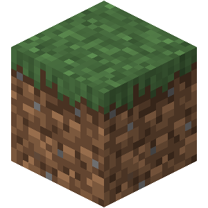
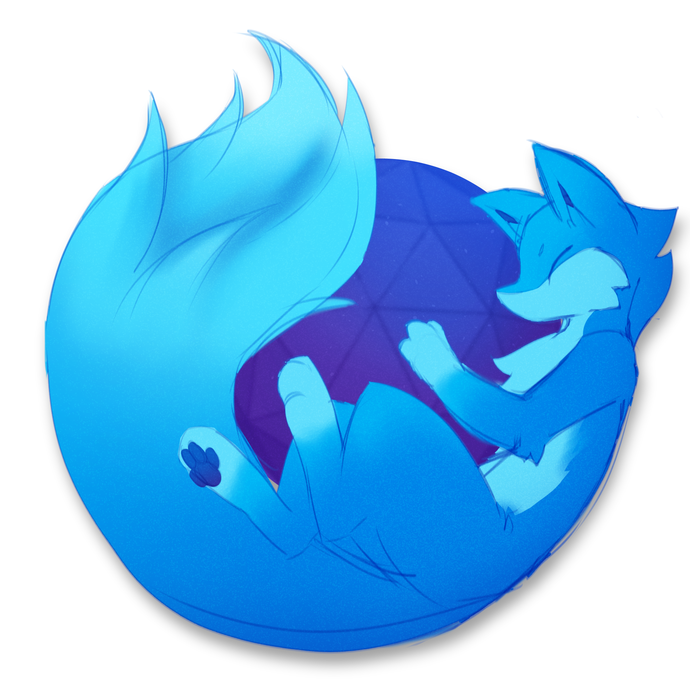
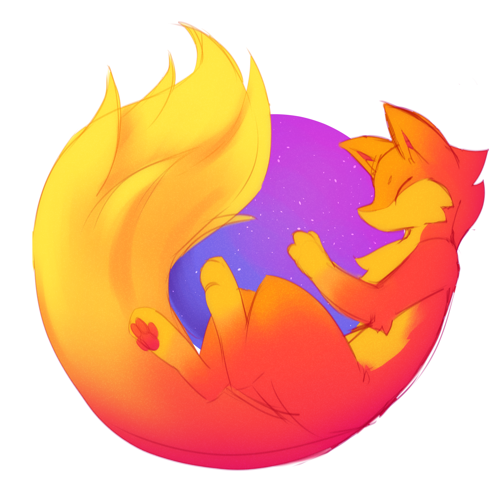

# md-emojis

Custom markdown emojis/icons for personal use

Modified SVGs by hand: `therian`, `modfest`, `modrinth`

Handmade SVGs: `plurality-simple`, `plurality-colors`

Feel free to PR with new stuff :3

## List

Format:

```html

```

- Replace `NAME` with emoji ID from the list below

<!--start:script-->

| Icon  | ID   | Link |
| :---: | :--- | :--- |
|  | `aperture.svg` | [Link](./emojis/aperture.svg) |
|  | `mdn.svg` | [Link](./emojis/mdn.svg) |
|  | `oneshot-sun-broken.png` | [Link](./emojis/oneshot-sun-broken.png) |
|  | `oneshot-sun.png` | [Link](./emojis/oneshot-sun.png) |
|  | `osu-outline-black.svg` | [Link](./emojis/osu-outline-black.svg) |
|  | `osu-outline-white.svg` | [Link](./emojis/osu-outline-white.svg) |
|  | `osu.png` | [Link](./emojis/osu.png) |
|  | `plurality-colors.svg` | [Link](./emojis/plurality-colors.svg) |
|  | `plurality-simple.svg` | [Link](./emojis/plurality-simple.svg) |
|  | `thetadelta-black.svg` | [Link](./emojis/thetadelta-black.svg) |
|  | `thetadelta-white.svg` | [Link](./emojis/thetadelta-white.svg) |
|  | `mc/hangar.png` | [Link](./emojis/mc/hangar.png) |
|  | `mc/lodestone.png` | [Link](./emojis/mc/lodestone.png) |
|  | `mc/minecraft.png` | [Link](./emojis/mc/minecraft.png) |
|  | `mc/minecraft.webp` | [Link](./emojis/mc/minecraft.webp) |
|  | `mc/modfest.svg` | [Link](./emojis/mc/modfest.svg) |
|  | `mc/modrinth.svg` | [Link](./emojis/mc/modrinth.svg) |
|  | `mc/spigot.png` | [Link](./emojis/mc/spigot.png) |
|  | `firefox/firefox-dev.svg` | [Link](./emojis/firefox/firefox-dev.svg) |
|  | `firefox/firefox-furry-dev.png` | [Link](./emojis/firefox/firefox-furry-dev.png) |
|  | `firefox/firefox-furry.png` | [Link](./emojis/firefox/firefox-furry.png) |
|  | `firefox/firefox.svg` | [Link](./emojis/firefox/firefox.svg) |

<!--end:script-->

List is auto generated, run `pnpm dev` if contributing.

- `firefox-furry[-dev]` by [LuxxArt](https://luxxart.carrd.co/)
- `plurality-colors` design by [Emmengard&](https://pluralpedia.org/w/Emmengard%27s_Plural_Rings)
