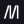

# md-emojis

Custom markdown emojis/icons for personal use

Modified SVGs by hand: `therian-*`, `modfest`, `modrinth`

Feel free to PR with new stuff :3

## List

Format:

```html

```

- Replace `NAME` with emoji ID from the list below

<!--start:script-->

| Icon  | ID   | Link |
| :---: | :--- | :--- |
|  | `firefox-dev.svg` | [Link](./emojis/firefox-dev.svg) |
|  | `firefox-furry-dev.png` | [Link](./emojis/firefox-furry-dev.png) |
|  | `firefox-furry.png` | [Link](./emojis/firefox-furry.png) |
|  | `firefox.svg` | [Link](./emojis/firefox.svg) |
|  | `hangar.png` | [Link](./emojis/hangar.png) |
|  | `lodestone.png` | [Link](./emojis/lodestone.png) |
|  | `mdn.svg` | [Link](./emojis/mdn.svg) |
|  | `minecraft.png` | [Link](./emojis/minecraft.png) |
|  | `minecraft.webp` | [Link](./emojis/minecraft.webp) |
|  | `modfest.svg` | [Link](./emojis/modfest.svg) |
|  | `modrinth.svg` | [Link](./emojis/modrinth.svg) |
|  | `oneshot-sun-broken.png` | [Link](./emojis/oneshot-sun-broken.png) |
|  | `oneshot-sun.png` | [Link](./emojis/oneshot-sun.png) |
|  | `osu-outline-black.svg` | [Link](./emojis/osu-outline-black.svg) |
|  | `osu-outline-white.svg` | [Link](./emojis/osu-outline-white.svg) |
|  | `osu.png` | [Link](./emojis/osu.png) |
|  | `plurality-simple.svg` | [Link](./emojis/plurality-simple.svg) |
|  | `spigot.png` | [Link](./emojis/spigot.png) |
|  | `thetadelta-black.svg` | [Link](./emojis/thetadelta-black.svg) |
|  | `thetadelta-white.svg` | [Link](./emojis/thetadelta-white.svg) |

<!--end:script-->

List is auto generated, run `pnpm dev` if contributing.
